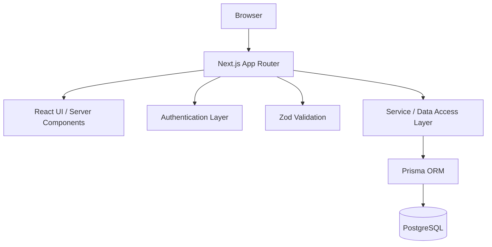

# Technical Architecture

## 1. Architecture Goal

Use a simple monolithic fullstack architecture appropriate for a probation project.

Do not introduce microservices or separate deployment units unless explicitly required.

Recommended architecture:



---

## 2. Recommended Stack

- **Framework:** Next.js App Router
- **Language:** TypeScript
- **Styling:** Tailwind CSS
- **Database:** PostgreSQL
- **ORM:** Prisma
- **Validation:** Zod
- **Authentication:** Auth.js or secure server-side session
- **Password Hashing:** bcrypt/argon2-compatible implementation

---

## 3. Application Boundaries

### Public UI
Responsible for:

- Homepage
- Event list
- Event detail
- Public data presentation

### Admin UI
Responsible for:

- Login
- Dashboard
- Event management forms/table
- Mutation feedback

### Server Layer
Responsible for:

- Authentication
- Authorization
- Input validation
- Business rules
- Database access
- Error normalization

### Database Layer
Responsible for:

- User/Admin persistence
- Event persistence

---

## 4. Server vs Client Components

Prefer Server Components for:

- Initial event data rendering
- Event detail retrieval
- Admin data pages where possible

Use Client Components only when required for:

- Interactive forms
- Modal/dialog state
- Mobile menu
- Search/filter client interactions
- Optimistic UI if later needed

Do not add `"use client"` at high-level layouts without a clear need.

---

## 5. Recommended Directory Structure

```text
app/
├── (public)/
│   ├── page.tsx
│   ├── events/
│   │   ├── page.tsx
│   │   └── [id]/
│   │       └── page.tsx
│   └── about/
│       └── page.tsx
│
├── admin/
│   ├── login/
│   │   └── page.tsx
│   ├── layout.tsx
│   ├── page.tsx
│   └── events/
│       ├── page.tsx
│       ├── new/
│       │   └── page.tsx
│       └── [id]/
│           └── edit/
│               └── page.tsx
│
├── api/
│   └── ...
│
└── layout.tsx

components/
├── ui/
├── layout/
├── event/
├── admin/
└── forms/

lib/
├── auth/
├── db/
├── services/
├── validations/
├── errors/
└── utils/

prisma/
├── schema.prisma
└── seed.ts

types/
public/
```

If Server Actions are preferred, keep action files close to their domain or inside `lib/actions/`. Do not duplicate the same mutation through multiple mechanisms without reason.

---

## 6. Request Lifecycle

### Read Flow

```text
Browser
  ↓
Next.js Page
  ↓
Event Service
  ↓
Prisma
  ↓
PostgreSQL
  ↓
Rendered UI
```

### Mutation Flow

```text
Admin Form
  ↓
Server Action / Route Handler
  ↓
Session Validation
  ↓
Authorization
  ↓
Zod Validation
  ↓
Event Service
  ↓
Prisma
  ↓
PostgreSQL
  ↓
Success/Error Result
  ↓
UI Feedback + Revalidation
```

---

## 7. Service Layer

Use a small service/data-access layer to prevent Prisma calls from being spread across UI components.

Example responsibilities:

```text
eventService.getAll()
eventService.getById()
eventService.create()
eventService.update()
eventService.delete()
```

Do not create unnecessary repository/factory abstractions unless complexity actually requires them.

---

## 8. Error Strategy

Internal errors should be normalized into predictable application errors.

Suggested categories:

- ValidationError
- AuthenticationError
- AuthorizationError
- NotFoundError
- ConflictError
- InternalError

Never expose sensitive stack traces or database details to public responses.

---

## 9. Security Rules

- Hash passwords.
- Validate all external input.
- Authorize every protected mutation server-side.
- Never trust route visibility as authorization.
- Never expose `AUTH_SECRET`, database credentials, or hashes.
- Keep `.env` ignored.
- Provide `.env.example`.
