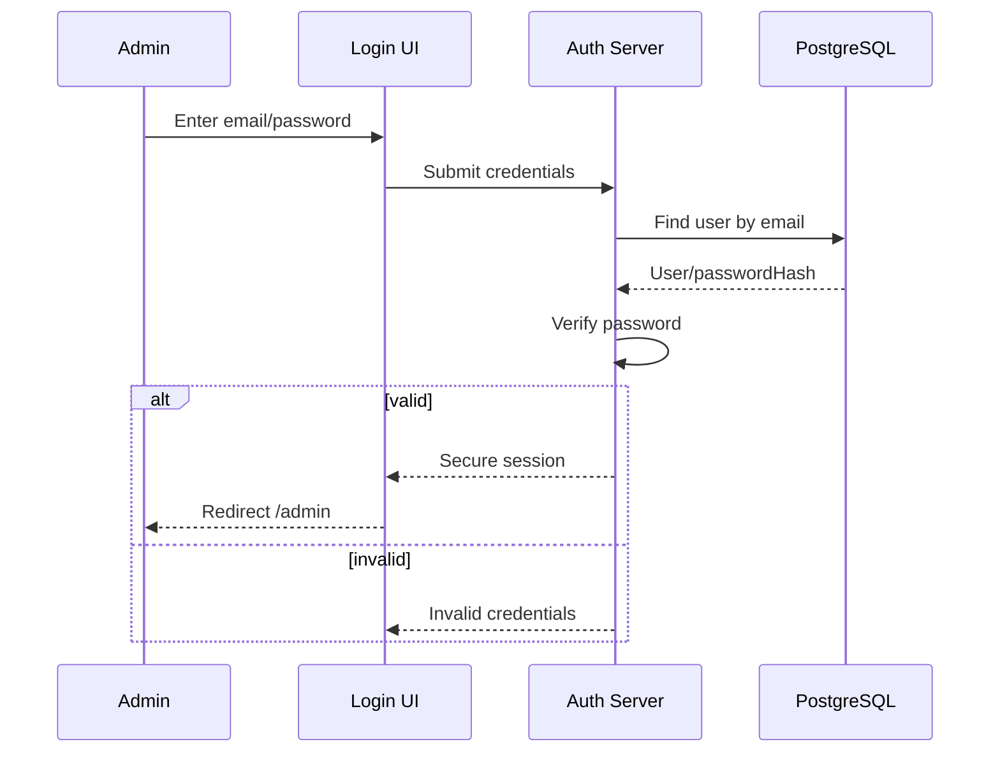

# Authentication & Authorization

## Implemented Strategy

NextAuth v4 Credentials uses bcrypt password verification and encrypted JWT cookies with an 8-hour lifetime. Every protected page and mutation also verifies that the administrator still exists in PostgreSQL. Only database-provisioned users can be admins. Mutation Route Handlers require a same-origin Origin header; NextAuth supplies its own login/logout CSRF protection. Failed sign-in messages do not reveal whether the email exists. A bounded in-process limiter allows up to 10 credential attempts per email per 15 minutes; use a shared limiter when deploying multiple instances. Logout clears the browser session cookie; per-session token revocation is outside this JWT implementation.

## 1. Goal

Only authorized admins may access event-management functionality.

Public event reading remains unauthenticated.

---

## 2. Recommended Strategy

Use **Auth.js credentials authentication** or a secure server-side session implementation.

Do not use localStorage as the source of authentication truth.

Recommended properties:

- Server-created session
- HTTP-only cookies
- Secure cookie in production
- SameSite protection
- Session expiration
- Password hashing

---

## 3. Password Storage

```text
Password
   ↓
Hash using bcrypt/argon2
   ↓
passwordHash stored in DB
```

Never:

- Store plaintext password
- Return password hash to client
- Log passwords
- Put evaluator passwords in source code

---

## 4. Login Flow



---

## 5. Protected Route Rules

Protected:

- `/admin`
- `/admin/events`
- `/admin/events/new`
- `/admin/events/[id]/edit`
- all create/update/delete server operations

Public:

- `/`
- `/events`
- `/events/[id]`
- `/about`
- `/admin/login`

---

## 6. Authorization

Even if middleware protects admin routes, every protected server mutation must independently verify authentication/authorization.

Correct:

```text
Delete Request
  ↓
Check server session
  ↓
Verify admin
  ↓
Validate target
  ↓
Delete
```

Incorrect:

```text
Button hidden in frontend
  ↓
Assume secure
```

---

## 7. Session Expiration

Use framework defaults unless there is a clear reason to configure otherwise.

Expired session:

- protected route → redirect to login
- protected API/mutation → return unauthenticated error

---

## 8. Login UX

States:

- Idle
- Submitting
- Invalid input
- Invalid credentials
- Unexpected server error

Avoid revealing whether a particular email address exists.

---

## 9. Seed/Demo Admin

For evaluator convenience, a development/demo account may be seeded.

Document credentials in the final README only if they are explicitly intended for evaluation and do not expose real credentials.
