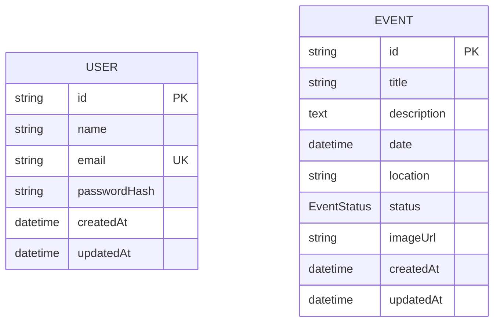
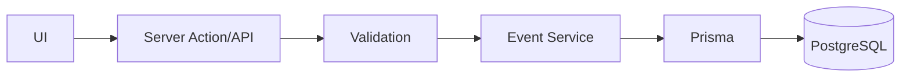

# Database Specification

## Implementation Notes

The initial migration is checked in under `prisma/migrations/20260919110430_init`. Dates are persisted in UTC and displayed/edited in Asia/Jakarta. The idempotent development seed uses stable demo event IDs so repeated runs do not duplicate events or overwrite edits. Admin credentials are required environment variables; passwords must be 12-72 characters and no more than 72 UTF-8 bytes. Local setup creates a project-only PostgreSQL cluster on port 5433. See the root README for setup and production configuration.

## 1. Database

Use **PostgreSQL** with **Prisma ORM**.

The guidebook requires at least User/Admin and Event entities.

---

## 2. ERD



No relationship between User and Event is required for the minimum scope.

Optional future enhancement:

- `createdById`
- `updatedById`

Do not add these until needed.

---

## 3. User Entity

| Field | Type | Constraint |
|---|---|---|
| id | String/UUID/CUID | Primary Key |
| name | String | Required |
| email | String | Required, Unique |
| passwordHash | String | Required |
| createdAt | DateTime | Auto |
| updatedAt | DateTime | Auto |

Rules:

- Email must be normalized.
- Password must never be stored directly.
- Do not expose `passwordHash` through public/application DTOs.

---

## 4. Event Entity

| Field | Type | Constraint |
|---|---|---|
| id | String/UUID/CUID | Primary Key |
| title | String | Required |
| description | Text | Required |
| date | DateTime | Required |
| location | String | Required |
| status | Enum | Required |
| imageUrl | String? | Optional |
| createdAt | DateTime | Auto |
| updatedAt | DateTime | Auto |

---

## 5. Event Status

Recommended enum:

```text
UPCOMING
ONGOING
COMPLETED
CANCELLED
```

If status is intended to be derived automatically from dates, document that decision before implementation. For probation scope, explicit persisted status is simpler and matches the required event field.

---

## 6. Suggested Prisma Schema

```prisma
enum EventStatus {
  UPCOMING
  ONGOING
  COMPLETED
  CANCELLED
}

model User {
  id           String   @id @default(cuid())
  name         String
  email        String   @unique
  passwordHash String
  createdAt    DateTime @default(now())
  updatedAt    DateTime @updatedAt
}

model Event {
  id          String      @id @default(cuid())
  title       String
  description String
  date        DateTime
  location    String
  status      EventStatus
  imageUrl    String?
  createdAt   DateTime    @default(now())
  updatedAt   DateTime    @updatedAt

  @@index([date])
  @@index([status])
}
```

---

## 7. Validation Rules

Recommended initial rules:

### User
- email: valid email
- password: minimum reasonable length at creation/seed time
- name: non-empty

### Event
- title: trimmed, non-empty, max length
- description: trimmed, non-empty
- date: valid date
- location: trimmed, non-empty
- status: valid enum
- imageUrl: valid URL if supplied

Exact max lengths should be defined in shared Zod schemas.

---

## 8. Migration Flow

```text
Change schema.prisma
      ↓
Review change
      ↓
Create Prisma migration
      ↓
Apply migration
      ↓
Update DATABASE.md if model meaning changes
      ↓
Run tests
```

Never use ad-hoc production schema changes without migration history.

---

## 9. Seed Strategy

Seed development data only.

Recommended seed:

- 1 evaluator/demo admin
- 3–6 sample events covering:
  - UPCOMING
  - ONGOING or COMPLETED
  - CANCELLED (optional)

Credentials must be configurable and must not contain real personal passwords.

---

## 10. Database Flow


