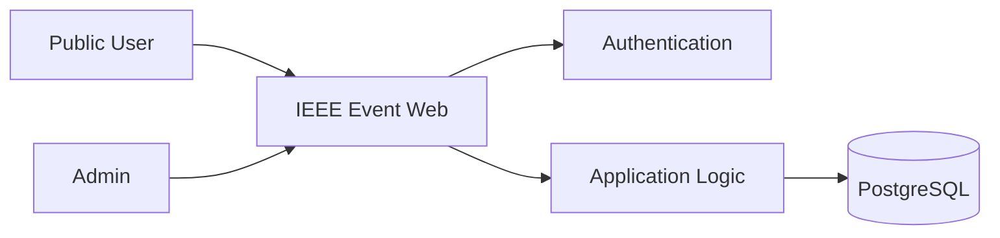
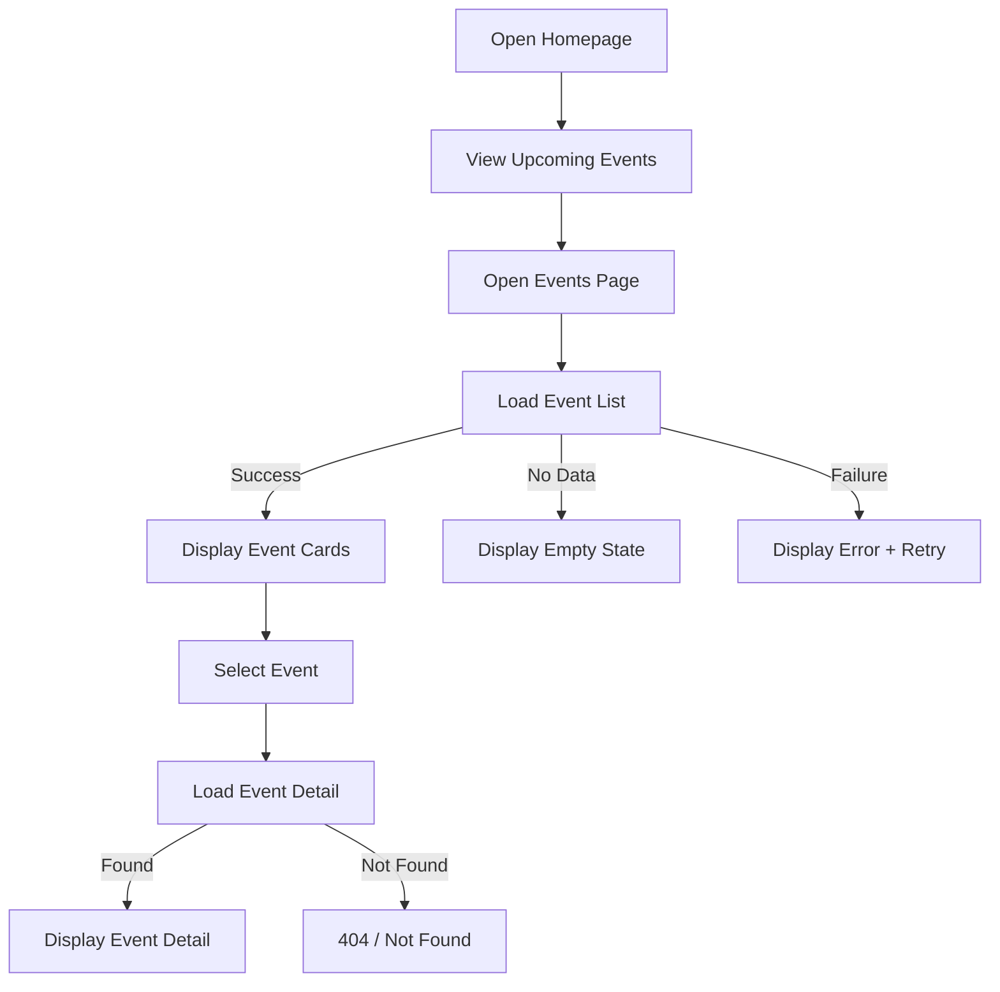
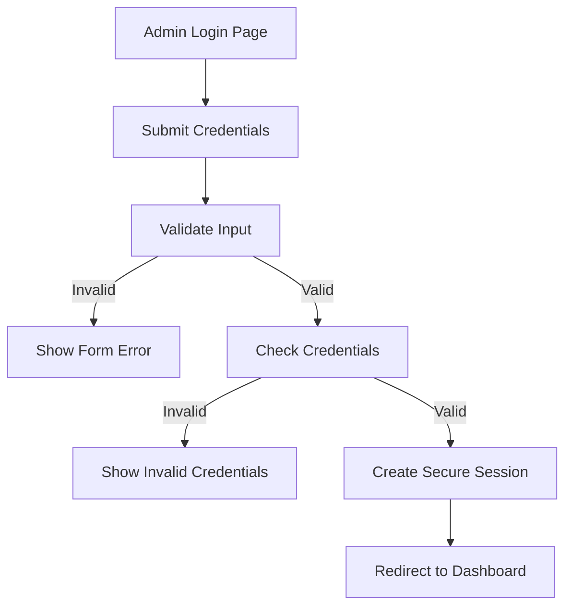
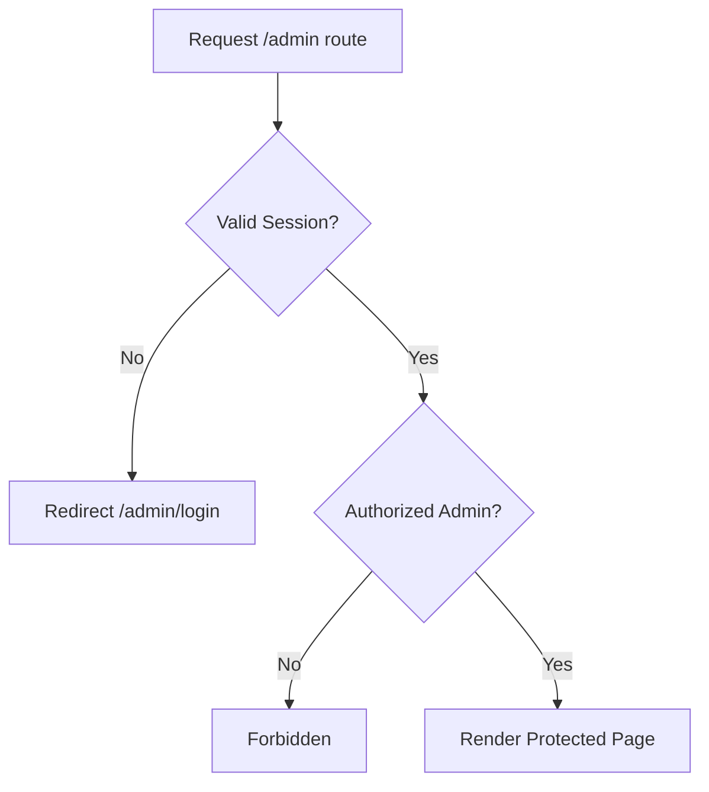
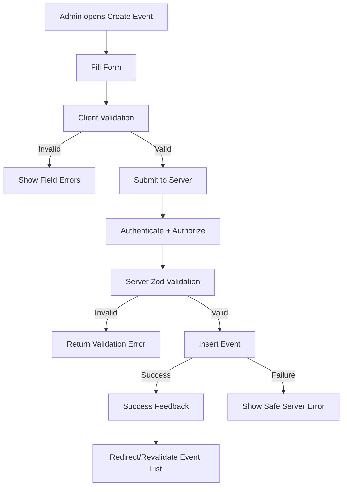
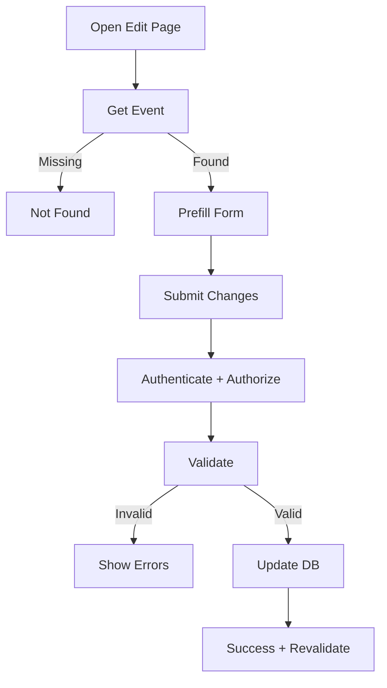
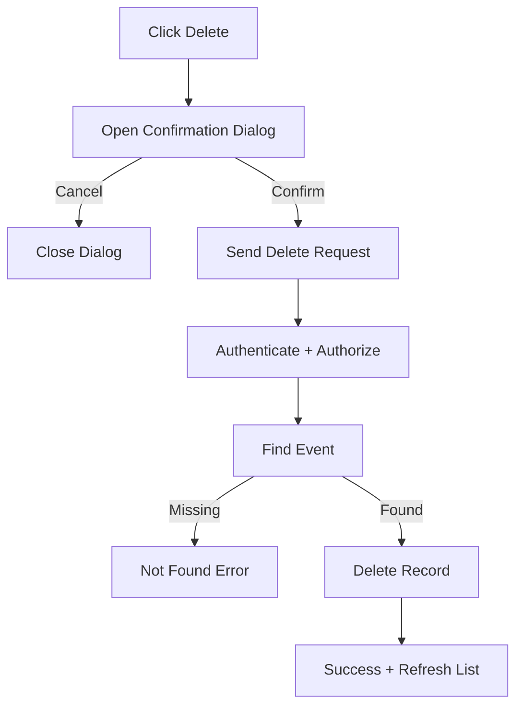

# System Flow

## 1. System Context



---

## 2. Public Event Flow



---

## 3. Admin Login Flow



---

## 4. Protected Route Flow



---

## 5. Create Event



---

## 6. Edit Event



---

## 7. Delete Event



---

## 8. Database Interaction Rule

All production CRUD flows must follow:

```text
UI
 ↓
Server Boundary
 ↓
Authentication/Authorization (when protected)
 ↓
Validation
 ↓
Service/Data Access
 ↓
Prisma
 ↓
PostgreSQL
```

The UI must never write directly to the database.

---

## 9. State Model

Data pages should explicitly support:

```text
Idle → Loading → Success
              ↘ Empty
              ↘ Error
```

Mutations should support:

```text
Idle → Submitting → Success
                ↘ Validation Error
                ↘ Server Error
```
